### 1、webpck的基本使用

### 2、配置入口和出口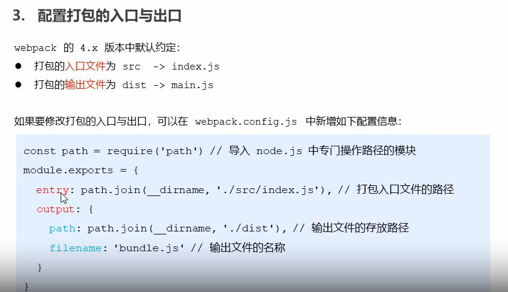

### 3、配置自动打包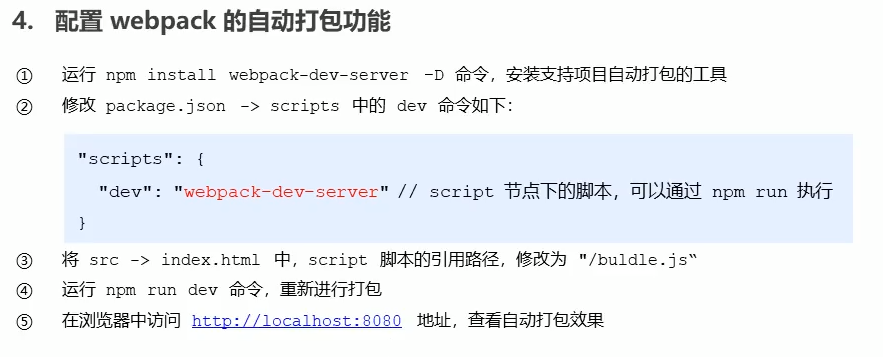

### 4、生成预览页面

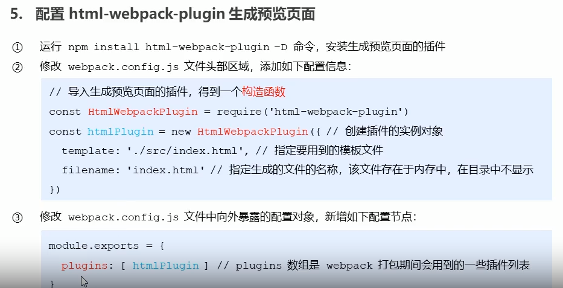

### 5、自动打包

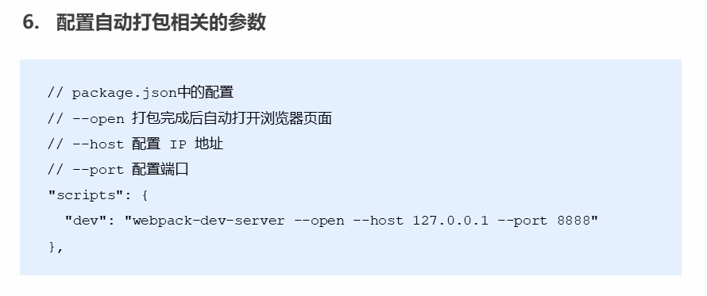

### 6、Loader

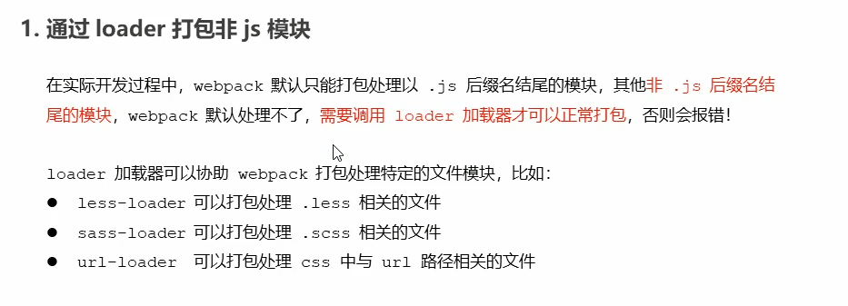

##### 打包处理CSS

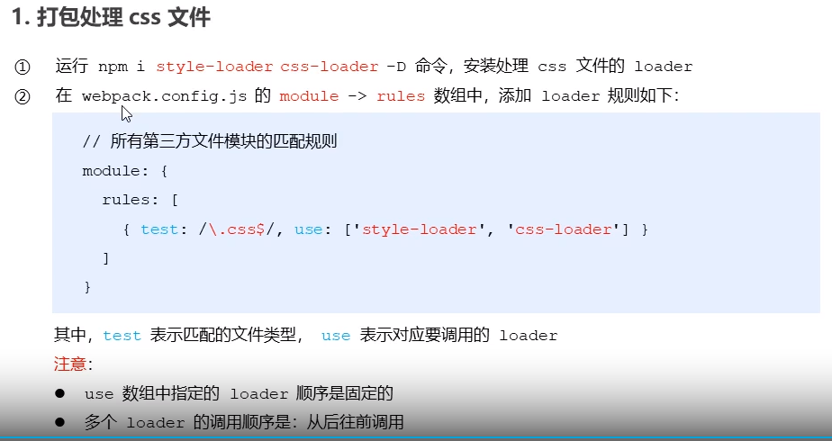

##### 打包处理less

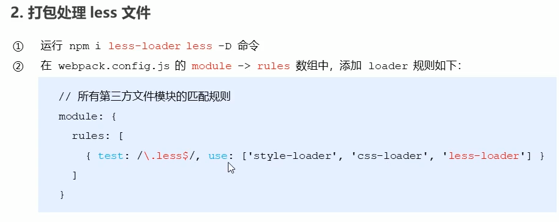

##### 打包处理scss

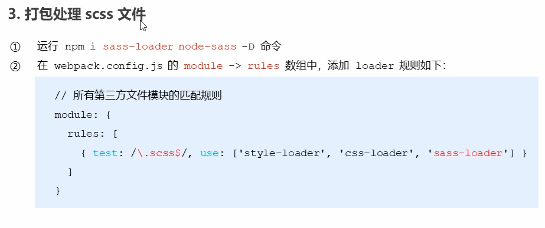

##### postCSS配置

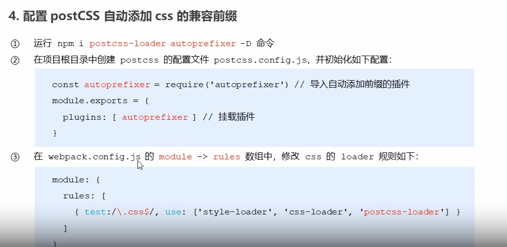

### 7、打包处理样式中的图片和字体文件

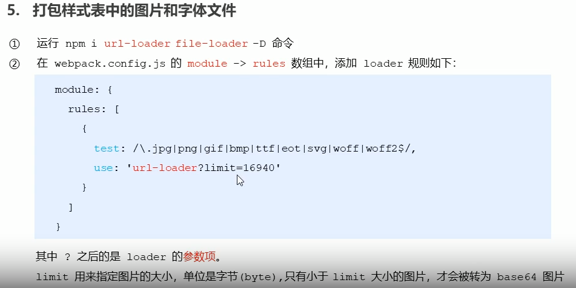

### 8、打包处理js中的高级语法

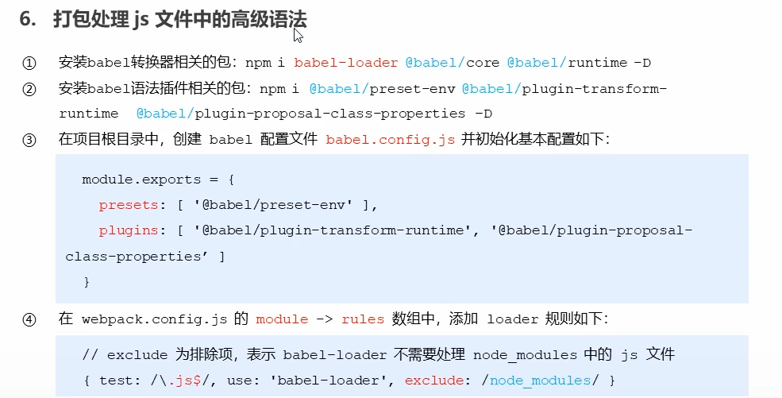

### 9、Vue配置

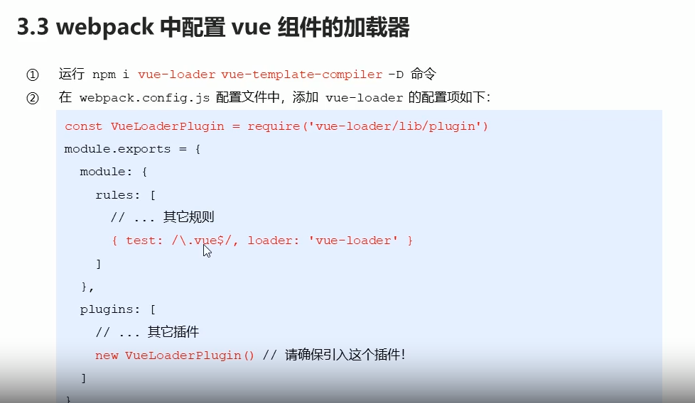

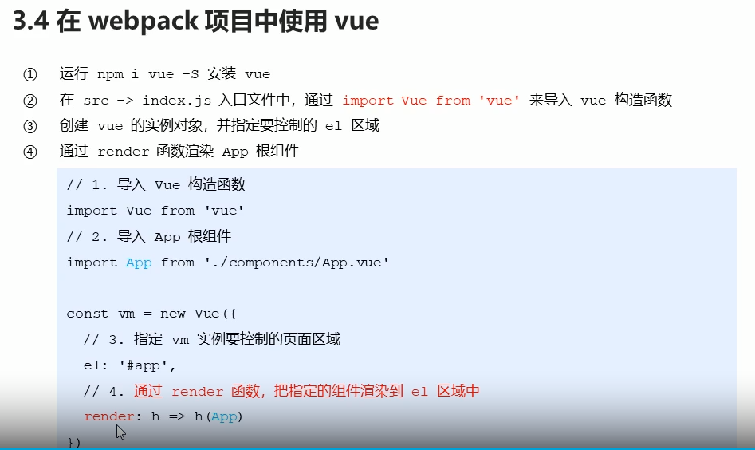

### 10、webpack打包发布

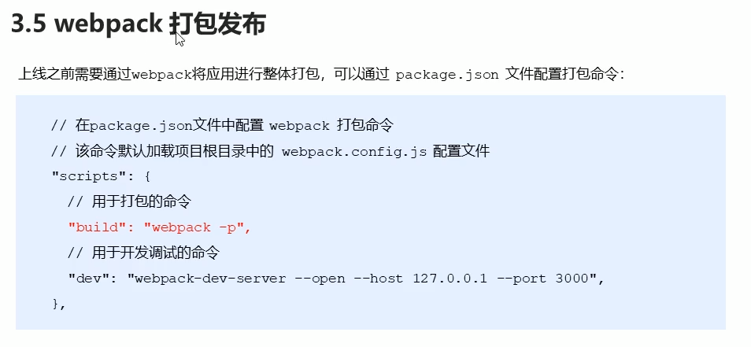

