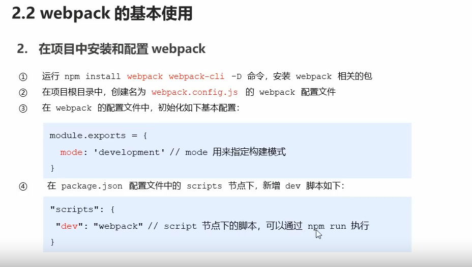

### 1、webpck的基本使用

### 2、配置入口和出口

### 3、配置自动打包

### 4、生成预览页面

### 5、自动打包

### 6、Loader

##### 打包处理CSS

##### 打包处理less

##### 打包处理scss

##### postCSS配置

### 7、打包处理样式中的图片和字体文件

### 8、打包处理js中的高级语法

### 9、Vue配置

### 10、webpack打包发布

